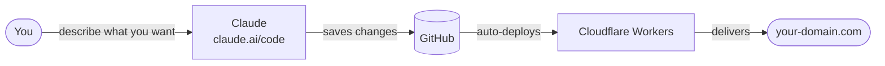

<div align="center">

# Build Your Personal Site with Vibes

Describe what you want. Claude builds and ships it. No coding required.

[](https://workers.cloudflare.com)
[](https://github.com)
[](https://claude.ai/code)

**Live example → [delamatre.com](https://www.delamatre.com)**

</div>

---

This is vibe coding: instead of writing code yourself, you prompt Claude to design, build, and update your site. Claude handles the files, commits, and deployment while you focus on what you want to say and how you want it to look.

## How it works



## What it costs

| Service | Cost | Notes |
|---|---|---|
| GitHub | Free | Where your site's files live |
| Cloudflare | Free | Hosting, SSL, and DNS included |
| Domain name | ~$10–15/year | The only real expense |
| Claude Pro | $20/month | Only needed when building or updating — not to keep the site running |

---

## Setup

One-time steps. Both GitHub and Cloudflare are free to sign up for.

1. **GitHub account** — Create a free account at github.com and make a new repo. This is where your site's files live.

2. **Cloudflare account** — Sign up at cloudflare.com. The free tier includes everything you need.

3. **Domain** — Register a domain through Cloudflare Registrar, or transfer an existing domain and point its nameservers to Cloudflare. The domain must be on Cloudflare's DNS for Workers routing to work.

4. **Create a Worker** — In the Cloudflare dashboard go to **Workers & Pages → Create → Worker** and give it a name.

5. **Connect to GitHub** — In the Worker's settings go to **Settings → Build** and connect your GitHub repo. From this point on, every change Claude makes goes live automatically.

6. **Add your domain** — In the Worker go to **Settings → Domains & Routes → Add Custom Domain** and enter your domain. Cloudflare handles SSL automatically.

7. **Disable the workers.dev subdomain** — Under **Settings → Domains & Routes**, disable the `*.workers.dev` URL. Also set `workers_dev: false` in `wrangler.jsonc` so deploys don't re-enable it.

8. **Add a security rule** *(optional)* — Ask Claude to set up a WAF rule in Cloudflare to block common bot traffic.

---

## Building your site

Your site is built entirely by prompting Claude — no terminal, no code editor required.

1. **Claude Pro subscription ($20/month)** — Required to use Claude on the web. You only need this when building or updating your site — not to keep it running.

2. **Design with Claude** — Use Claude Design to create your site's look and feel. Describe your style, content, and goals and Claude will produce a design you can use as the blueprint for the build.

3. **Initial build** — Start a Claude session at claude.ai/code, connect it to your repo, and share the design. Claude will build the site and publish it automatically.

4. **Add CLAUDE.md** *(optional)* — This repo includes a `CLAUDE.md` file that teaches Claude how your site works. Ask Claude to add it: *"Please add the CLAUDE.md file from the vibe-site repo to my project."* Once it's there, Claude will follow the rules automatically every session without you having to explain anything.

5. **Iterate** — Keep prompting Claude to add pages, update content, or tweak the design. Changes go live in seconds.

---

## Sample prompts

### Design

Use these with Claude Design before the initial build.

| Goal | Prompt |
|---|---|
| Minimal writer's site | *"A minimal personal site for a writer. Neutral tones, generous whitespace, serif headings, monospace body text."* |
| Dark modern | *"Clean and modern with a dark background, accent color in teal, and a grid-based layout."* |
| Warm personal | *"Warm and personal — like a notebook. Off-white background, handwritten-style headings, soft shadows."* |
| Simple homepage | *"Homepage with a short bio, a list of recent writing, and links to a few projects."* |
| Single page | *"A single-page site with sections for about, work, and contact."* |

### Build & update

Use these in a Claude Code session.

**Adding content**
```
Add a now entry: just got back from a week in the mountains.
```
```
Add a new curations category called 'Books' with a first item: Thinking in Systems by Donella Meadows, a classic introduction to systems thinking.
```
```
Update my bio in the about page to mention I moved to Portland.
```

**Building new pages**
```
Add a /now page that shows a reverse-chronological list of short status updates.
```
```
Create a /curations page with categories. Each category links to its own page listing items with titles, links, and descriptions.
```
```
Add a /uses page listing the hardware and software I use daily.
```

**Features**
```
Pull live tide data from NOAA for my local gauge and display it on the homepage.
```
```
Add a dark/light mode toggle that persists across sessions.
```
```
Add a /feed.xml RSS feed for my now entries.
```

**Maintenance**
```
Audit the site for any dead code or unused assets and remove them.
```
```
Review the CSP headers and tighten anything that's too permissive.
```
```
Update llms.txt to reflect the current state of the site.
```
