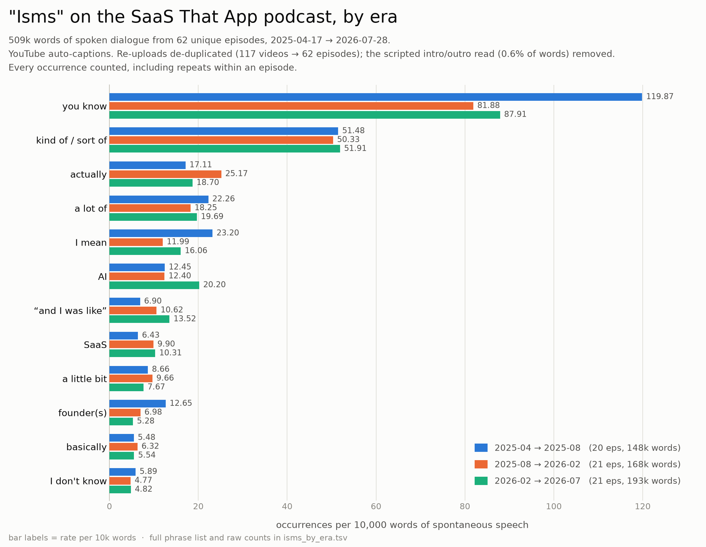

# "Isms" analysis — SaaS That App podcast

Counts of recurring turns of phrase across the podcast's spoken dialogue,
measured as **occurrences per 10,000 words** so eras with different amounts of
material stay comparable.

- **62 unique episodes**, 2025-04-17 → 2026-07-28
- **508,541 words** of spontaneous speech analysed
- Full phrase list, regexes and raw counts: [`isms_by_era.tsv`](isms_by_era.tsv)
  · machine-readable: [`isms.json`](isms.json)

## Method

Source text is the transcript set in [`../transcripts/`](../transcripts/), which
is YouTube's own caption data. Four corrections are applied before counting,
each of which materially changes the numbers:

1. **Shorts excluded.** The channel's 253 shorts are clips cut from the
   episodes; counting them would double-weight whichever passages got clipped.
2. **Re-uploads de-duplicated.** 55 of the 117 videos are second uploads of an
   episode already in the set — a different cut, transcribed by a separate ASR
   pass. Their 3-gram containment against their twin is 0.80–0.89, versus 0.07
   for unrelated episodes, which is how they were identified. The longest cut of
   each title is kept, leaving 62 episodes.
3. **Scripted read removed.** Every episode recites the same intro and sign-off.
   Left in, the show's own tagline would rank as its top "ism" in ~62 copies.
   Whole-sentence matching does not find these — each episode is a separate ASR
   pass, so the wording drifts — so detection works on 8-gram shingles appearing
   in ≥30% of episodes. This removes 0.6% of words.
4. **ASR spelling variants folded together.** "SaaS" is transcribed as `saas`,
   `sas` and `sass`; matching only the first would undercount it by ~60%.

## Caveats

- These are **auto-generated captions**, not a verified transcript. Proper nouns
  and technical terms are unreliable, and the counts inherit any systematic ASR
  bias — filler words in particular are transcribed inconsistently, so treat the
  absolute rates as approximate and the era-to-era comparison as the signal.
- There are **no speaker labels**, so hosts and guests are pooled. A phrase that
  rises across eras may reflect a change in guest mix rather than in either
  host's speech.
- Era boundaries are chronological thirds of the episode list, not a natural
  break in the show.

## Reproducing

Scripts are in [`scripts/`](scripts/), run in this order:

| Script | Does |
|---|---|
| `clean.py` | yt-dlp VTT → de-duplicated plain-text transcripts |
| `manifest.py` | builds the transcript README and CSV index |
| `discover.py` | dedupes re-uploads, strips boilerplate, ranks n-grams |
| `analyze.py` | counts the curated phrase list by era → TSV + JSON |
| `plot.py` | renders the chart |

Captions were fetched with `yt-dlp --skip-download --write-subs
--write-auto-subs --sub-langs "en.*"`.
